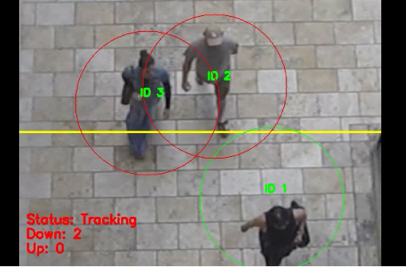

# Real-Time detection of Social Distancing



## This is just proof of concept and implemented quick hand, so don't ask to fork it and use it for your purposes.

# Real-Time Sample Results


# Dataset
Dataset can be either from webcam or any video from realtime showing people in public space. 

# 1. Usage
*Install Library*
`OpenCV`<b>
`scipy` <b>
`dlib` <b>
`imutils`<b>
`numpy`<b>
`time`<b>
`argparse`<b>


# 2. Use Command Line

*safe distance of 1 m has been considered as a norm of social distancing.*
Command Line execution for the realtime testing can be done bby executing-
```
python people_counter.py --prototxt mobilenet_ssd/MobileNetSSD_deploy.prototxt \
  --model mobilenet_ssd/MobileNetSSD_deploy.caffemodel --input videos/example_01.mp4 \
    --output output/output_01.avi
```

# 3. Use of webcam

```
 python people_counter.py --prototxt mobilenet_ssd/MobileNetSSD_deploy.prototxt \
   --model mobilenet_ssd/MobileNetSSD_deploy.caffemodel \
   --output output/webcam_output.avi

```

# 3. Special Thanks/ reference

*The complete code has been adapted from the pyimage search code. Hence, I offer my sincere acknowledgement to them.* 